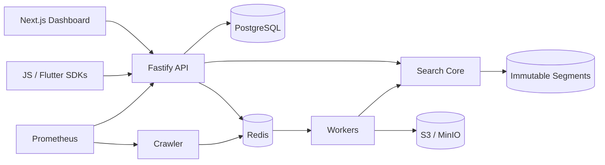

# SearchForge

SearchForge is a developer-focused search platform that **crawls, analyzes, indexes, ranks, and searches content**. It is deliberately not a CRUD wrapper around a hosted search vendor: the repository contains its own language analyzers, inverted index, BM25 scorer, prefix/typo candidate generation, immutable index version model, crawler safety layer, job pipeline, SDKs, and observability.

```text
Website / Documents
        ↓
      Crawler
        ↓
     Extractor
        ↓
     Analyzer
        ↓
    Index Builder
        ↓
  Search Engine
        ↓
 REST / SDK / UI
```

## Architecture



## What is implemented

- Multi-tenant data model for users, organizations, projects, memberships, sources, indexes, versions, jobs, API keys, analytics, and audit logs.
- Secure auth primitives: Argon2id passwords, refresh-token rotation/reuse detection model, verification/reset tokens, rate-limit hooks.
- Website crawler primitives with robots.txt, sitemap parsing, URL normalization, redirect checks, size/content-type limits, SSRF/private-network protection, and content deduplication.
- English + Arabic analyzers, configurable Arabic normalization, light stemming, field-aware inverted index, positional postings, BM25, phrase matching, prefix search, typo-aware term expansion, filters, facets, safe highlight ranges, autocomplete, and explain output.
- BullMQ queues for crawl/fetch/extract/normalize/index/merge/analytics/cleanup.
- Atomic index-version activation and rollback semantics in metadata.
- REST API, JavaScript SDK, Flutter SDK skeleton, dashboard, health/readiness, Prometheus metrics, structured errors, request IDs, Docker Compose, and CI.

## Quick start

```bash
cp .env.example .env
corepack enable
pnpm install
docker compose up -d postgres redis minio
pnpm dev
```

Full container stack:

```bash
docker compose up --build
```

Observability profile:

```bash
docker compose --profile observability up --build
```

API: `http://localhost:4000`  
Dashboard: `http://localhost:3000`  
MinIO console: `http://localhost:9001`  
Grafana (full profile): `http://localhost:3001`

## Search request

```http
POST /v1/indexes/docs/search
Authorization: Bearer sf_search_...
Content-Type: application/json

{
  "query": "distributed systems",
  "filters": {"category": "docs"},
  "facets": ["category"],
  "limit": 20
}
```

## Engineering targets

Targets are intentionally not published as achieved benchmarks. Use `tests/load` against your own hardware and dataset and publish p50/p95/p99 with corpus size, index size, CPU/RAM, and concurrency.

- low-millisecond autocomplete from a hot cache
- sub-100 ms typical lexical search on moderate indexes
- bounded per-domain crawl concurrency
- zero-downtime index activation

## Security defaults

Crawler access to loopback, link-local, RFC1918, IPv6 local/private ranges, credential-bearing URLs, non-HTTP schemes, and unsafe redirects is denied by default. API keys are represented by a visible prefix plus a one-way digest; plaintext secrets are returned once only.

See [docs/security.md](docs/security.md) and [docs/architecture.md](docs/architecture.md).

## Roadmap

MVP focuses on lexical retrieval. The core exposes boundaries for sharding, replica selection, vector stores, hybrid fusion, external source connectors, and ranking experiments without making them mandatory.
