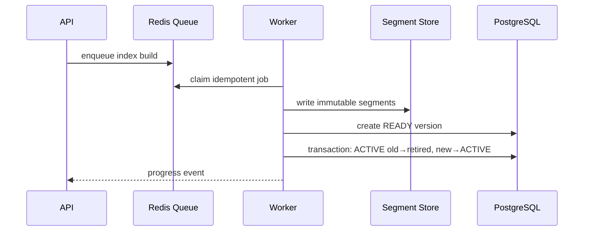

# Architecture

SearchForge separates the SaaS control plane from the retrieval data plane.

## Control plane

PostgreSQL owns durable product metadata: identities, organizations, memberships, projects, sources, index settings, API keys, jobs, index versions, audit events, and aggregate analytics. Redis owns ephemeral queue and cache state.

## Retrieval plane

`@searchforge/search-core` is independently testable. Documents are analyzed into field-scoped terms and immutable segments. New builds write a new version, validate it, then atomically update the active version pointer. Existing readers continue using the previous immutable version until their request finishes.

## Scaling boundary

The initial topology is one API/search process plus workers. Search-core interfaces keep document routing and segment readers separate so a later coordinator can route requests to shards and replicas without changing the public API.

Future:
1. consistent project/index → shard routing;
2. replicated immutable segment stores;
3. coordinator fan-out;
4. per-shard top-k;
5. deterministic result merge;
6. optional RRF/weighted fusion with vector retrieval.
